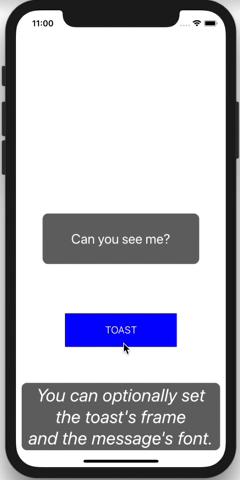

# HNToaster

[](https://travis-ci.org/hahnah/HNToaster)
[](https://cocoapods.org/pods/HNToaster)
[](https://cocoapods.org/pods/HNToaster)
[](https://cocoapods.org/pods/HNToaster)

## Example

To run the example project, clone the repo, and run `pod install` from the Example directory first.

#### Screenshot



## Installation

HNToaster is available through [CocoaPods](https://cocoapods.org). To install
it, simply add the following line to your Podfile:

```ruby
pod 'HNToaster'
```

## Usage

First of all, import HNToaster in your swift file.

```swift
import HNToaster
```

#### Simple Usage

Toast appears in the center of the view.

```swift
let message1: String = "Can you see me?"
Toaster.toast(onView: self.view, message: message1)
```

#### Options Available

You can set position and area of the toast by `frame` parameter.  
And also the font's style and size are settable by `font` parameter. 

```swift
let message2: String = """
You can arrange
the toast's frame
and the message's font.
"""

let toastFrame: CGRect = CGRect(x: 10, y: self.view.bounds.height - 120, width: self.view.bounds.width - 20, height: 90)

let messageFont: UIFont = UIFont.boldSystemFont(ofSize: 24)

Toaster.toast(onView: self.view, message: message2, frame: toastFrame, font: messageFont)
```

## Author

hahnah, [https://superhahnah.com/](https://superhahnah.com/)

## License

HNToaster is available under the MIT license. See the LICENSE file for more info.
